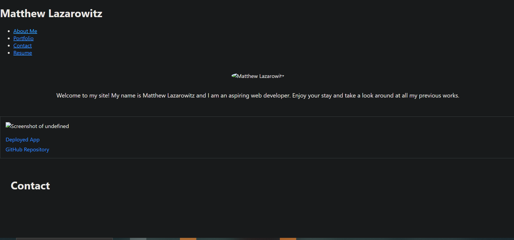

# updated_portfolio_react

## Repo Link

https://github.com/matthewlazarowitz/updated_portfolio_react

## Screenshot

## Deployed App Link
https://matthewlazarowitz.github.io/updated_portfolio_react/

## Description

In this challenge, I created a dynamic and interactive portfolio website that showcases my web development projects and personal information. To build the portfolio, I utilized React.js, a popular JavaScript library for building user interfaces. React's component-based architecture allowed me to efficiently create reusable UI elements and manage the flow of data between different parts of the application. The projects' data is stored in an array, making it easy to update and add new projects as needed.  Furthermore, I implemented a contact form that enables visitors to get in touch with me. The form validates user input and provides real-time feedback to ensure that all required fields are properly filled out. Upon successful submission, the form triggers a function to handle the data and reset the input fields.  For deployment, I utilized GitHub Pages, which hosts the portfolio website and makes it accessible to anyone.

## Installation

N/A

## Usage

 I utilized React.js to architect the portfolio website from the ground up. React's component-based approach enabled me to efficiently develop reusable user interface elements, ensuring a consistent and polished look throughout the site. I harnessed the power of GitHub Pages for deployment. This step ensured that my portfolio is accessible to a global audience and can be easily shared with potential employers and collaborators. By successfully deploying the portfolio, I showcased my competence not only in web development but also in the deployment process.  In summary, this portfolio project encapsulates my proficiency in craftin interactive web experiences using React.js.

## Credits

(JD Tadlock)  (RUT-VIRT-FSF-FT-05-2023-U-LOLC)

## License

MIT License

Copyright (c) 2023 matthewlazarowitz

Permission is hereby granted, free of charge, to any person obtaining a copy
of this software and associated documentation files (the "Software"), to deal
in the Software without restriction, including without limitation the rights
to use, copy, modify, merge, publish, distribute, sublicense, and/or sell
copies of the Software, and to permit persons to whom the Software is
furnished to do so, subject to the following conditions:

The above copyright notice and this permission notice shall be included in all
copies or substantial portions of the Software.

THE SOFTWARE IS PROVIDED "AS IS", WITHOUT WARRANTY OF ANY KIND, EXPRESS OR
IMPLIED, INCLUDING BUT NOT LIMITED TO THE WARRANTIES OF MERCHANTABILITY,
FITNESS FOR A PARTICULAR PURPOSE AND NONINFRINGEMENT. IN NO EVENT SHALL THE
AUTHORS OR COPYRIGHT HOLDERS BE LIABLE FOR ANY CLAIM, DAMAGES OR OTHER
LIABILITY, WHETHER IN AN ACTION OF CONTRACT, TORT OR OTHERWISE, ARISING FROM,
OUT OF OR IN CONNECTION WITH THE SOFTWARE OR THE USE OR OTHER DEALINGS IN THE
SOFTWARE.

